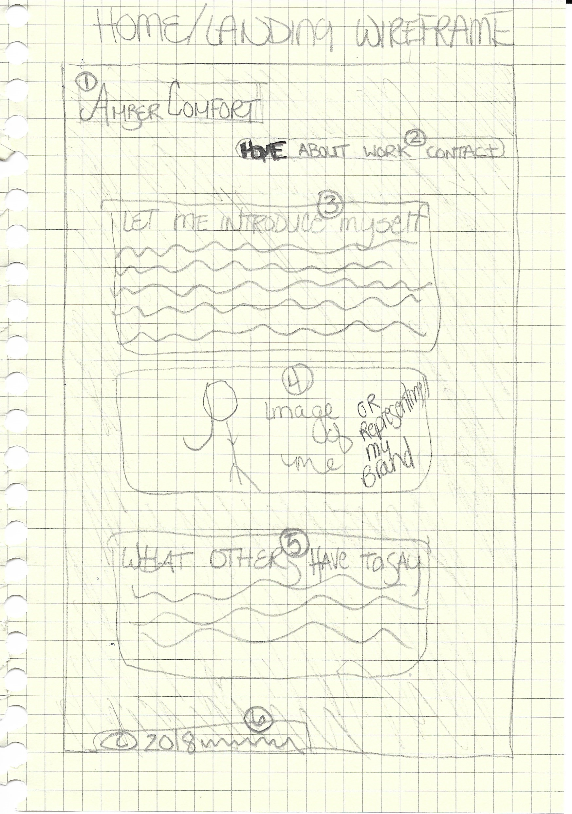
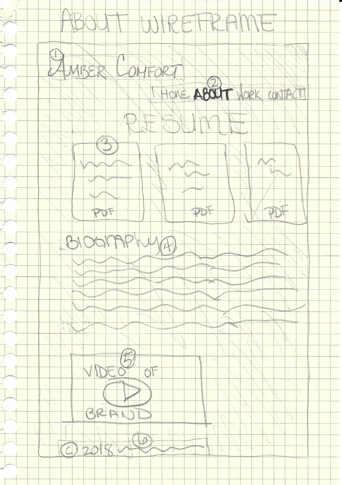
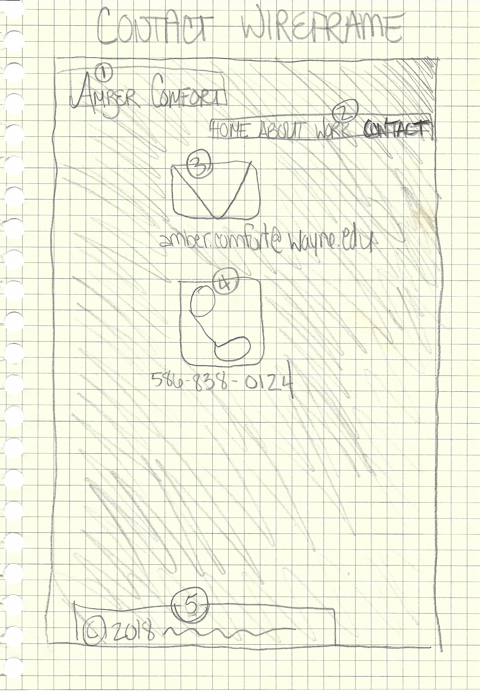

# My INF 7420 Project

I will build a professional portfolio site to showcase my skills to potential employers. The main purpose of this site will be to advertise my diverse experience.

## Wireframes

In order to plan the architecture and layout of my site, I have created some rough wireframe sketches of some of the pages for my site.

1. Heading, will include my name

2. Navigation, will include links to various pages of my site.

3. Main Content, will include a introduction to myself and my mission of the site.

4. Main Content cont., will include a photo or image representing me or my brand.

5. Main Content cont., will include professional testimonials and recommendations.

6. Footer, will include copyright and date

1. Header, will include my name

2. Navigation, will include links to various pages of my site.

3. Main Content, will include clickable .pdf files of my resume.

4. Main Content cont., will include a personal biography.

5. Main Content cont., will include a embedded video representing me/my brand.

6. Footer, will include copyright and date

1. Header, will include my name.

2. Navigation, will include linkes to various pages of my site.

3. Main Content, clickable link to e-mail with me.

4. Main Content cont., clickable icon to call me.

5. Footer, will include copyright and date.
